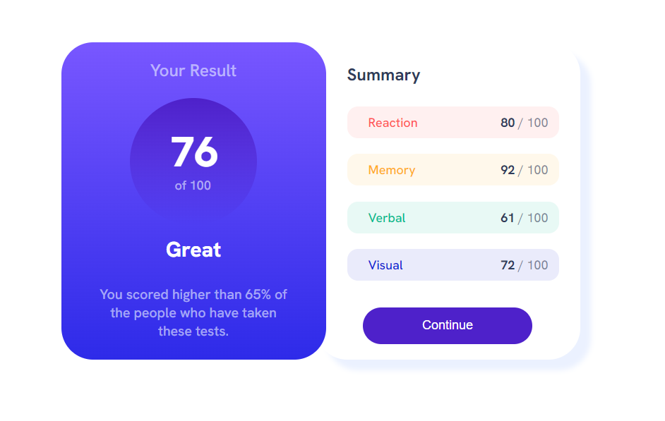

# Frontend Mentor - Results summary component solution

This is a solution to the [Results summary component challenge on Frontend Mentor](https://www.frontendmentor.io/challenges/results-summary-component-CE_K6s0maV). Frontend Mentor challenges help you improve your coding skills by building realistic projects.

## Table of contents

- [Overview](#overview)
  - [Screenshot](#screenshot)
  - [Links](#links)
  - [Built with](#built-with)
  - [What I learned](#what-i-learned)
  - [Useful resources](#useful-resources)
- [Author](#author)

## Overview

Project Name: **Results summary component**

Date: 30-08-2023

### Screenshot



### Links

- Solution URL: [Github](https://github.com/Abdulmajid48/resultsummary)
- Live Site URL: [Vercel](https://vercel.com/abdulmajid48/resultsummary)

### Built with

- Semantic HTML5 markup
- CSS custom properties
- Flexbox
- Google fonts
- Font Awesome

### What I learned

Incorporating `Flexbox` and `@media` into this project was a transformative experience. It empowered me to create responsive, well-aligned, and aesthetically pleasing layouts with less effort and cleaner code. The flexibility and versatility of Flexbox made it a cornerstone of the project's design and a skill I'll undoubtedly carry forward to future endeavors.

```css
@media (max-width: 1440px) {
  .motherdiv {
    display: flex;
    flex-direction: row;
    justify-content: center;
    align-items: center;
    height: 100vh;
  }

  .blue-square {
    flex-basis: 250px;
    height: 300px;
    background-image: linear-gradient(hsl(252, 100%, 67%), hsl(241, 81%, 54%));
    border-radius: 30px;
    color: hsl(0, 0%, 100%);
    z-index: 1;
  }

  .white-square {
    background-color: hsl(0, 0%, 100%);
    flex-basis: 250px;
    height: 300px;
    border-radius: 30px;
    position: relative;
    left: -10px;
    box-shadow: 10px 10px 5px hsl(221, 100%, 96%);
  }
}
```

### Useful resources

- [Font Awesome](https://www.fontawesome.com) - This simplifies the process of adding icons to code. I really liked this pattern and will use it going forward.

## Author

- [Hasnode](https://abdulmajid.hashnode.dev)
- [Frontendmentor](https://www.frontendmentor.io/profile/Abdulmajid48)
- [Twitter](https://www.twitter.com/aladejanaamajid)
